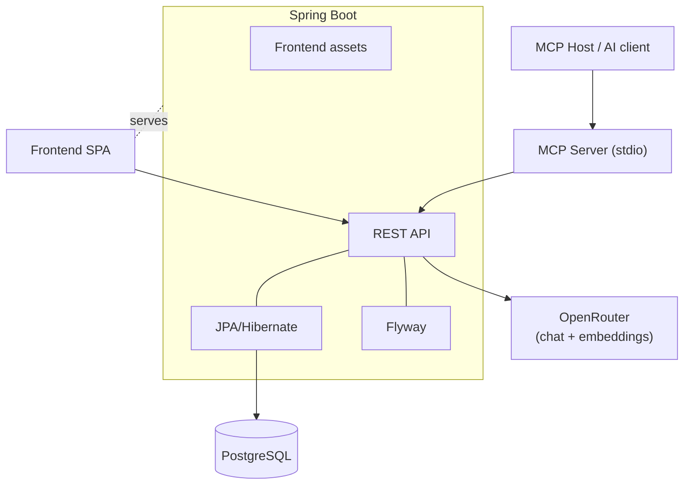

# Quizmaster Architecture

Quizmaster follows a traditional client-server architecture.

## Frontend

Frontend is a Single-Page Application (SPA) in [React 19](https://react.dev/). It uses [react-router](https://reactrouter.com/) for routing.

## Backend

Backend is a Spring Boot application, serving both frontend as a SPA (Single-Page Application) at URL `\`, and REST APIs for the frontend at URLs starting with `\api\`.

- Uses [Lombok](https://projectlombok.org/) to reduce boilerplate code.

Data are stored in a PostgreSQL database.

- DB is accessed using JPA/Hibernate,
- data scheme versioned and migrated using Flyway.

## Component Diagram

## AI Assistant

Question generation calls **OpenRouter** through two endpoints sharing one API
token: chat completions for drafting and embeddings for duplicate avoidance.
The component diagram above shows OpenRouter as a single external dependency
of the REST API.

For the architecture, contracts between frontend and backend, the
embedding-based duplicate-avoidance flow, and configuration, see
[ai-assistant.md](ai-assistant.md).

## MCP Server

The MCP server (`mcp/` package) is a separate Node.js process that exposes
Quizmaster as Model Context Protocol tools, resources, and prompts over stdio.

**Boundary rule:** the MCP server is a thin REST shim. It does not connect to
PostgreSQL, does not duplicate backend validation, and does not implement an
MCP-only authorization model. Whatever the REST API enforces, MCP enforces by
construction.

This means workspace-scoped REST routes (`/api/workspaces/{guid}/...`) and the
legacy header-based routes (`/api/workspace/...` with `X-Workspace-Key`) both
need to keep working — the FE uses the latter, MCP uses the former, and both map
to the same controllers.

Specs: `specs/features/mcpserver/mcp-spec.md`,
`specs/features/mcpserver/mcp-server-configuration.md`,
`specs/features/mcpserver/rest-auth-spec.md`.
