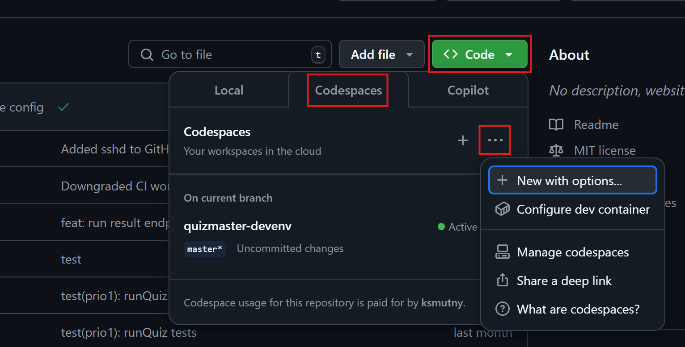

# Develop Quizmaster in GitHub Codespaces

## Create a Codespace

1. Go to GitHub repo [scrumdojo/quizmaster](https://github.com/scrumdojo/quizmaster) and create a Codespace.

    

2. Select machine type: 4 cores / 16GB

3. The codespace opens a web version of VS Code in a new browser tab.

Congratulations, you're good to go! You can either work from the browser window,
or open the codespace from your VS Code.

> GitHub Codespaces is **paid** service, however the first 120 core-hours per month are free. You can run 4-core codespace for 30 hours. \
The codespace stops after an hour of inactivity. **Make sure you don't have any active SSH connection to the codespace, as it keeps it alive!**

## ⚠️ Troubleshooting

### 403: Permission denied when `git push`

Inside the Codespace, Github automatically signs you in using your Github account. However after some time
the auth token expires for some reason and you need to login again.

In terminal inside the Codespace, run

```sh
export GITHUB_TOKEN=
gh auth login
```

Follow the instructions on the screen. (Login using HTTPS and browser is probably the easiest.)

If you work from VS Code in browser, it might not be enough and you may need to create a new container.

## Optional: Setup SSH access

If you want to use IntelliJ IDEA or Cursor, you need to setup SSH access to the codespace.

### Config SSH

You need [GitHub CLI](https://cli.github.com/) to set it up. Install it if you haven't already.

1. **Create an SSH key** (local machine)

    On your local machine, go to `~/.ssh` and run:

    ```bash
    ssh-keygen -t rsa -b 4096 -C “your.email@example.com” -f ~/.ssh/quizmaster_codespace
    ```

2. **Add public key to the Codespace** (in your codespace)

    In your Codespace `mkdir ~/.ssh && cd ~/.ssh` and add the content
    of `~/.ssh/quizmaster_codespace.pub` from your local machine to `authorized_keys`.

    ```bash
    echo "<content of quizmaster_codespace.pub>" >> ~/.ssh/authorized_keys
    ```

3. **Configure Codespace SSH** (local machine)

    ```bash
    gh auth login
    gh codespace list
    gh codespace ssh --config
    ```

    Paste the output of the last command to `~/.ssh/config` on your local machine.

### Connect from IntelliJ IDEA

Make sure the Codespace is running on <https://github.com/codespaces>.

1. On the IntelliJ IDEA Welcome screen, select "Remote Development > SSH". Press New Project button.

2. Copy `Host` from your local `~/.ssh/config` (see above)

3. Create a new Connection (cog icon on the right):
    - Host: `<Host from your ~/.ssh/config>`
    - Port: `2222`
    - Authentication type: OpenSSH config and authentication agent
    - Username: empty
    - Password: empty

4. Connect to the newly created Connection.

5. In the "Choose IDE and Project" screen
    - Select IDE version (recommended latest non-RC release)
    - Select Project directory: `/workspaces/quizmaster`
