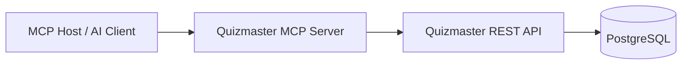

# Quizmaster MCP server

The MCP server (`mcp/`) is a Node.js process that exposes Quizmaster as
Model Context Protocol tools, resources, and prompts to AI clients over
stdio.

## Boundary rule

The MCP server is a thin REST shim. It does not connect to PostgreSQL, does
not duplicate backend validation, and does not implement an MCP-only
authorization model. Whatever the REST API enforces, MCP enforces by
construction.

## Architecture

The MCP server owns protocol concerns: MCP initialization and capability
declaration, tool/resource/prompt registration, JSON schema validation for
tool inputs, mapping REST failures into MCP errors, and formatting returned
data for assistants. The Spring Boot backend owns persistence, domain
validation, AI assistant integration, and HTTP status semantics.

## What's exposed

The authoritative list of tools, resources, and prompts lives in the source —
this doc only names them. See the named files for the current set:

- **Tools** — `mcp/src/tools.ts`. Names use the `quizmaster_` prefix.
  Operations cover health, workspace/question/quiz CRUD, stats, and AI
  drafting.
- **Resources** — `mcp/src/resources.ts`. URIs use the `quizmaster://`
  scheme, including `quizmaster://domain-language` (served from
  [../domain-language.md](../domain-language.md)).
- **Prompts** — `mcp/src/prompts.ts`. Guided multi-step prompts for question
  authoring and workspace review.

## Related docs

- [configuration.md](configuration.md) — how to run and configure the server.
- [rest-auth.md](rest-auth.md) — current REST auth state (none).
- [../../backlog/mcp-spec.md](../../backlog/mcp-spec.md) — the original
  specification: goals, non-goals, full tool/resource/prompt schemas,
  validation rules, and migration notes.
