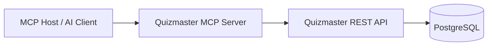

# Quizmaster MCP Server Specification

## Purpose

Build a Model Context Protocol (MCP) server that lets AI clients inspect and manage Quizmaster workspaces, questions, quizzes, quiz statistics, and AI-generated question drafts through the existing Quizmaster REST API.

The server must be a thin integration layer. It should not read or write PostgreSQL directly, duplicate backend business rules, or bypass the validation already implemented by the Spring Boot application.

## Goals

- Expose Quizmaster domain data as MCP resources for assistant context.
- Expose safe, structured MCP tools for creating and maintaining workspaces, questions, and quizzes.
- Reuse the existing REST API contracts and shared TypeScript domain types where practical.
- Support local AI coding clients through stdio as the first transport.
- Keep the implementation independent from frontend runtime concerns.
- Make write operations explicit and easy for MCP clients to confirm with the user.

## Non-Goals

- Do not replace the existing REST API.
- Do not implement quiz taking through MCP in the first version.
- Do not introduce direct database access from the MCP server.
- Do not implement a separate MCP-only authentication model. Once REST authentication exists, reuse the Quizmaster model described in `rest-auth-spec.md`.
- Do not expose raw environment variables, database connection details, or internal service configuration as resources.

## Recommended Implementation Shape

Create a new package at `mcp/`:

```text
mcp/
  package.json
  tsconfig.json
  src/
    index.ts
    config.ts
    quizmaster-client.ts
    resources.ts
    tools.ts
    prompts.ts
    schemas.ts
```

Use TypeScript because the repository already uses pnpm and shared TypeScript contracts in `shared/types`. The MCP server should depend on the official MCP TypeScript SDK and call Quizmaster REST endpoints through `fetch`.

Root scripts to add after implementation:

```json5
"install:mcp": "cd mcp && pnpm install",
"mcp": "cd mcp && pnpm start",
"code:mcp:tsc": "cd mcp && pnpm tsc -b",
"code:mcp": "pnpm code:mcp:tsc",
```

`install:all` and `code` can include these scripts once the package exists.

## Runtime Configuration

| Variable | Required | Default | Description |
| --- | --- | --- | --- |
| `QUIZMASTER_MCP_TRANSPORT` | No | `stdio` | Transport. `stdio` is required for MVP. `http` is optional later. |
| `QUIZMASTER_MCP_BASE_URL` | No | `https://quizmaster.scrumdojo.cz` | Quizmaster REST API base URL. Set explicitly for local or test backends. |
| `QUIZMASTER_MCP_LOG_LEVEL` | No | `info` | Log level. Logs must go to stderr for stdio. |
| `QUIZMASTER_MCP_REQUEST_TIMEOUT_MS` | No | `10000` | Timeout for REST calls. |

The CLI runtime defaults to `https://quizmaster.scrumdojo.cz` as its Quizmaster base URL. Legacy `QUIZMASTER_BASE_URL` values are ignored so stale frontend or backend configuration does not redirect MCP writes. Use `QUIZMASTER_MCP_BASE_URL` only when a non-production MCP target is explicit.

The stdio transport must never write logs or diagnostics to stdout. Stdout is reserved for MCP JSON-RPC messages.

## Architecture



The MCP server owns protocol concerns:

- MCP initialization and capability declaration.
- Tool, resource, and prompt registration.
- JSON schema validation for tool inputs.
- Mapping REST failures into MCP errors.
- Formatting returned data for assistants.

The Spring Boot backend owns application concerns:

- Workspace, question, quiz, attempt, and statistics persistence.
- Domain validation.
- AI assistant integration.
- HTTP status semantics.

## MCP Capabilities

The MVP server must declare:

- `tools`: supported.
- `resources`: supported with resource templates.
- `prompts`: supported.

Resource subscriptions and list-changed notifications are not required for MVP. They can be added after a persistent HTTP transport exists.

## Resource URI Scheme

Use a custom scheme:

```text
quizmaster://...
```

All resource contents should be returned as UTF-8 JSON or Markdown text.

| URI | MIME Type | Description |
| --- | --- | --- |
| `quizmaster://domain-language` | `text/markdown` | Domain language from `docs/domain-language.md`. |
| `quizmaster://workspace/{workspaceGuid}` | `application/json` | Workspace metadata. |
| `quizmaster://workspace/{workspaceGuid}/questions` | `application/json` | Question list items for a workspace. |
| `quizmaster://workspace/{workspaceGuid}/quizzes` | `application/json` | Quiz list items for a workspace. |
| `quizmaster://workspace/{workspaceGuid}/question/{questionId}` | `application/json` | Full workspace-scoped question. |
| `quizmaster://quiz/{quizId}` | `application/json` | Full public quiz representation. |
| `quizmaster://workspace/{workspaceGuid}/quiz/{quizId}/stats` | `application/json` | Quiz statistics for a workspace quiz. |

The server cannot list all workspaces because the current REST API has no workspace index endpoint. Clients must provide a workspace GUID or create a workspace first.

## Tools

Tool names use `quizmaster_` prefixes to avoid collisions with other MCP servers.

### `quizmaster_health`

Checks whether the configured Quizmaster backend is reachable.

Input:

```json
{}
```

Output:

```json
{
  "baseUrl": "https://quizmaster.scrumdojo.cz",
  "reachable": true
}
```

Implementation: call `GET /api/feature-flag` if available, otherwise `GET /`.

### `quizmaster_create_workspace`

Creates a new workspace.

Input:

```json
{
  "title": "Team Training"
}
```

REST mapping: `POST /api/workspaces`

Output:

```json
{
  "guid": "workspace-guid"
}
```

### `quizmaster_get_workspace`

Reads one workspace.

Input:

```json
{
  "workspaceGuid": "workspace-guid"
}
```

REST mapping: `GET /api/workspaces/{guid}`

### `quizmaster_list_questions`

Lists questions in a workspace.

Input:

```json
{
  "workspaceGuid": "workspace-guid"
}
```

REST mapping: `GET /api/workspaces/{guid}/questions`

### `quizmaster_get_question`

Reads a full workspace-scoped question.

Input:

```json
{
  "workspaceGuid": "workspace-guid",
  "questionId": 42
}
```

REST mapping: `GET /api/workspaces/{guid}/questions/{id}`

### `quizmaster_create_question`

Creates a question in a workspace.

Input schema mirrors `QuestionRequest`:

```json
{
  "workspaceGuid": "workspace-guid",
  "question": "What is the capital of France?",
  "answers": ["Paris", "Montreal", "Nice", "Bordeaux"],
  "correctAnswers": [0],
  "explanations": ["Correct.", "Incorrect.", "Incorrect.", "Incorrect."],
  "questionExplanation": "Paris is the capital of France.",
  "questionType": "single",
  "isEasy": false,
  "imageUrl": null,
  "tolerance": null,
  "tags": ["geography"]
}
```

REST mapping: `POST /api/workspaces/{guid}/questions`

Output:

```json
{
  "id": 42
}
```

### `quizmaster_update_question`

Replaces the editable fields of an existing question.

Input: same as `quizmaster_create_question` plus `questionId`.

REST mapping: `PATCH /api/workspaces/{guid}/questions/{id}`

### `quizmaster_delete_question`

Deletes a question.

Input:

```json
{
  "workspaceGuid": "workspace-guid",
  "questionId": 42
}
```

REST mapping: `DELETE /api/workspaces/{guid}/questions/{id}`

This tool is destructive. It must be marked as destructive in tool metadata if supported by the MCP SDK.

### `quizmaster_list_quizzes`

Lists quizzes in a workspace.

Input:

```json
{
  "workspaceGuid": "workspace-guid"
}
```

REST mapping: `GET /api/workspaces/{guid}/quizzes`

### `quizmaster_get_quiz`

Reads a full quiz.

Input:

```json
{
  "quizId": 7
}
```

REST mapping: `GET /api/quiz/{id}`

### `quizmaster_create_quiz`

Creates a quiz in a workspace.

Input schema mirrors `QuizRequest`:

```json
{
  "workspaceGuid": "workspace-guid",
  "title": "Sprint Planning Basics",
  "description": "A short quiz for facilitation practice.",
  "startAt": null,
  "endAt": null,
  "questionIds": [1, 2, 3],
  "mode": "exam",
  "difficulty": "keep-question",
  "passScore": 80,
  "timeLimit": 600,
  "randomQuestionCount": 0
}
```

REST mapping: `POST /api/workspaces/{guid}/quizzes`

The request body must include `workspaceGuid`, because the existing backend entity mapping expects it in the quiz payload too.

### `quizmaster_update_quiz`

Updates a quiz in a workspace.

Input: same as `quizmaster_create_quiz` plus `quizId`.

REST mapping: `PUT /api/workspaces/{guid}/quizzes/{id}`

### `quizmaster_delete_quiz`

Deletes a quiz.

Input:

```json
{
  "workspaceGuid": "workspace-guid",
  "quizId": 7
}
```

REST mapping: `DELETE /api/workspaces/{guid}/quizzes/{id}`

This tool is destructive. It must be marked as destructive in tool metadata if supported by the MCP SDK.

### `quizmaster_get_quiz_stats`

Reads quiz statistics.

Input:

```json
{
  "workspaceGuid": "workspace-guid",
  "quizId": 7
}
```

REST mapping: `GET /api/workspaces/{guid}/quizzes/{id}/stats`

### `quizmaster_generate_question_draft`

Uses the existing Quizmaster AI assistant to draft a question. The tool returns a draft only; it does not save it.

Input:

```json
{
  "question": "Create a question about Definition of Done.",
  "questionType": "multiple"
}
```

REST mapping: `POST /api/ai-assistant`

Output: `QuestionDraft`

This tool may fail with `503` when the backend has no AI token configured, or `502` when the upstream assistant fails.

## Prompts

### `quizmaster_create_question`

Purpose: guide an assistant through creating a high-quality Quizmaster question before calling `quizmaster_create_question`.

Arguments:

- `workspaceGuid` required.
- `topic` required.
- `questionType` optional, one of `single`, `multiple`, `numerical`.
- `tags` optional.

Prompt behavior:

- Ask for missing topic or type before calling tools.
- Use `quizmaster_generate_question_draft` when the user wants AI help.
- Validate the draft against question rules.
- Save only after the user approves the final wording.

### `quizmaster_review_workspace`

Purpose: review a workspace for quiz-authoring quality.

Arguments:

- `workspaceGuid` required.

Prompt behavior:

- Read workspace, questions, and quizzes.
- Identify missing explanations, weak distractors, untagged questions, and quizzes with no questions.
- Suggest improvements before making changes.

### `quizmaster_create_quiz_from_tags`

Purpose: create a quiz from existing questions filtered by tags.

Arguments:

- `workspaceGuid` required.
- `title` required.
- `tags` required.
- `mode` optional.
- `difficulty` optional.

Prompt behavior:

- List questions.
- Select matching question IDs.
- Ask the user to confirm the quiz configuration.
- Call `quizmaster_create_quiz` after confirmation.

## Domain Validation Rules

The MCP server should validate inputs before sending them to the REST API and still let the backend remain the source of truth.

Question rules:

- `question` must be non-empty.
- `questionType` must be `single`, `multiple`, or `numerical`.
- `answers` and `explanations` must have the same length for choice questions.
- `correctAnswers` contains zero-based answer indexes.
- `single` questions must have exactly one correct answer.
- `multiple` questions must have at least two correct answers.
- `numerical` questions must have exactly one answer, `correctAnswers` must be `[0]`, and `tolerance` must be absent or non-negative.
- `tags` defaults to an empty array.

Quiz rules:

- `title` must be non-empty.
- `mode` must be `learn` or `exam`.
- `difficulty` must be `easy`, `hard`, or `keep-question`.
- `passScore` must be between `0` and `100`.
- `timeLimit` is expressed in seconds and must be positive when provided.
- `randomQuestionCount` defaults to `0`, meaning all selected questions.
- `startAt` and `endAt` are ISO date-time strings or `null`.
- `endAt` should not be before `startAt`.

## Error Handling

Map REST responses into MCP results consistently:

| REST Status | MCP Behavior |
| --- | --- |
| `200`, `204` | Return successful structured content. |
| `400` | Return tool error with validation details when available. |
| `404` | Return not-found tool/resource error. |
| `502`, `503` | Return upstream-service tool error, mainly for AI assistant calls. |
| Timeout | Return backend-timeout tool error with configured timeout. |
| Network failure | Return backend-unreachable tool error with the configured base URL. |

Tool failures should set `isError: true` and include a short human-readable message plus structured details where possible.

## Security and Safety

- Treat the MCP server as a production Quizmaster integration by default.
- Require explicit user confirmation in the host for write and delete tools.
- Validate all `quizmaster://` URIs before serving resources.
- Do not include secrets in tool results, resource content, logs, or errors.
- For stdio, write logs only to stderr.
- If Streamable HTTP is added, bind to `127.0.0.1` by default and validate `Origin` headers.

## Testing Strategy

Unit tests in `mcp/`:

- Tool input schema validation.
- REST URL construction.
- REST error mapping.
- Resource URI parsing.
- Prompt registration.

Integration tests:

- Start the backend with test data.
- Run the MCP server in-process or over stdio.
- Verify representative `tools/list`, `tools/call`, `resources/read`, and `prompts/get` flows.

Manual smoke test:

1. Start MCP server with `pnpm mcp`.
2. Connect from an MCP host.
3. Create a workspace.
4. Generate a question draft.
5. Save the question.
6. Create a quiz from the saved question.
7. Read quiz stats.

## Definition of Done

- `mcp/` package builds in TypeScript strict mode.
- Root install and code scripts include MCP package.
- Tools, resources, and prompts from this specification are registered.
- Existing backend REST tests still pass.
- MCP unit tests cover schemas, URI parsing, and REST error mapping.
- Documentation includes setup instructions and a sample host configuration.
- No MCP logs are emitted to stdout in stdio mode.

## Open Questions

- Should Quizmaster add a `GET /api/workspaces` endpoint so MCP clients can discover existing workspaces?
- Should write tools require an explicit `confirm: true` argument in addition to host-level confirmation?
- Should generated question drafts be stored as separate draft entities in the backend later?
- Should the HTTP MCP transport be implemented as a separate local server or embedded into Spring Boot?

## References

- MCP overview: https://modelcontextprotocol.io/specification/2025-06-18/basic/index
- MCP transports: https://modelcontextprotocol.io/specification/2025-06-18/basic/transports
- MCP tools: https://modelcontextprotocol.io/specification/2025-06-18/server/tools
- MCP resources: https://modelcontextprotocol.io/specification/2025-06-18/server/resources
- MCP prompts: https://modelcontextprotocol.io/specification/2025-06-18/server/prompts
